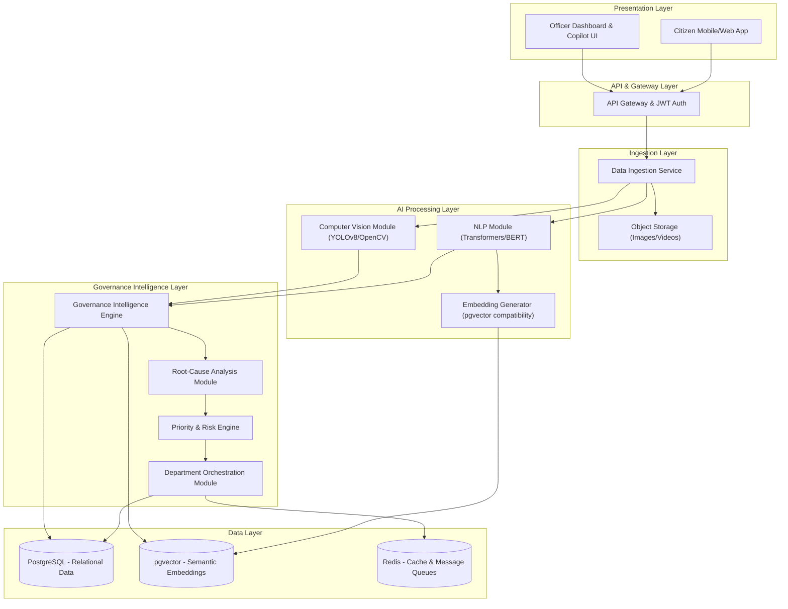
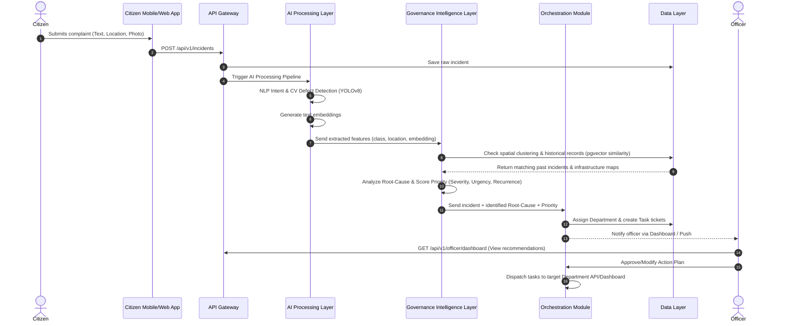
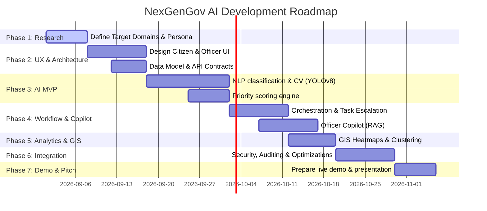

# Preliminary Design Report (PDR)
## Project: NexGenGov AI
### Autonomous Governance Intelligence Platform
**From Reactive Governance to Predictive Governance**

---

### Document Control & Metadata

| Field | Details |
| :--- | :--- |
| **Project Name** | NexGenGov AI |
| **Document Type** | Preliminary Design Report (PDR) |
| **Target Event** | Smart India Hackathon (SIH) Preparation |
| **Version** | v1.0.0 |
| **Status** | Draft - Approved for Prototype Implementation |
| **Date** | August 23, 2026 |

---

## 1. Executive Summary & Vision

Modern municipal and state governance systems are overwhelmingly **reactive**. They operate on a transactional model: a citizen experiences a problem (e.g., a pothole, a water leak, or accumulated garbage), submits a ticket, a manual routing process assigns it to a department, and the department eventually resolves it. While this resolves immediate issues, it fails to address underlying systemic failures, leading to repeated occurrences of the same problem, inefficient resource distribution, and high administrative overhead.

**NexGenGov AI** is designed as a centralized, AI-powered governance decision-support layer that shifts this paradigm from **reactive** to **predictive** governance. 

```
[Citizen / IoT Ingestion] ──> [AI Context & Correlation] ──> [Root-Cause Insight] ──> [Coordinated Action]
```

Rather than replacing existing ticketing systems, NexGenGov AI sits above them. It ingests data from multiple channels (citizen reports, historical logs, GIS, weather, and IoT sensors), analyzes the broader spatial-temporal context, estimates probable root causes, assigns multi-departmental action plans, and continuously learns from outcome feedback.

---

## 2. Problem Definition & Requirement Analysis

### 2.1 Problem Statements
*   **Siloed Information:** Data is distributed across disparate departments (e.g., Public Works, Water Sanitation, Traffic). An issue reported to one department may stem from a cause managed by another.
*   **Ticket-Centric Triage:** Complaints are treated as isolated events rather than spatial-temporal patterns (e.g., multiple citizens reporting minor road issues in the same 50m radius).
*   **Manual Classification Delays:** Triage processes depend on manual review, leading to bottlenecks and slow routing.
*   **Repetitive Infrastructure Failures:** Recurring problems (e.g., a road repeatedly collapsing) are repaired without identifying the root cause (e.g., a leaking underground water pipe).
*   **Lack of Unified Data Analytics:** GIS data, weather patterns, and historical maintenance logs are not integrated during real-time ticket triage.

### 2.2 System Requirements

#### Functional Requirements (FR)
1.  **Multimodal Ingestion:** Support submission of text, voice (with audio-to-text translation), image, video, and GPS coordinates.
2.  **AI-Based Classification:** Automatically classify incoming reports by category and department.
3.  **Visual Defect Identification:** Analyze images/videos to identify infrastructure issues (potholes, garbage, water leaks) and assess severity.
4.  **Contextual Correlation:** Cross-reference complaints with historical tickets within a spatial radius (e.g., 100 meters) and time window (e.g., 30 days).
5.  **Root-Cause Hypothesis:** Detect recurring failure loops and correlate with infrastructure layouts (e.g., utility piping maps).
6.  **Dynamic Priority Scoring:** Assign priority scores based on public safety, safety risk, recurrence, and population density.
7.  **Multi-Department Orchestration:** Create linked workflows when an incident requires action from multiple departments.

#### Non-Functional Requirements (NFR)
1.  **Explainability:** AI-generated recommendations and root-cause hypotheses must display confidence scores and supporting evidence.
2.  **Security & Privacy:** Redact Personally Identifiable Information (PII) before routing to analytical modules. Secure access using Role-Based Access Control (RBAC).
3.  **Local Language Support:** Support local language translations for text and voice inputs.
4.  **Auditability:** Keep immutable logs of all automated assignments, status escalations, and official approvals.

---

## 3. High-Level System Architecture

NexGenGov AI utilizes a modular, layered architecture designed for scalability, low-latency AI inference, and seamless integration with external APIs.



### 3.1 Layer Breakdown

1.  **Presentation Layer:** Contains the React-based portal for municipal officers and the cross-platform Flutter mobile application for citizens.
2.  **API Gateway Layer:** Manages routing, rate limiting, and authenticates requests using JWT.
3.  **Data Ingestion Layer:** Receives text, images, and telemetry data. Stores media in object storage and registers the incident in PostgreSQL.
4.  **AI Processing Layer:** Employs specialized models. NLP processes text/voice transcripts, YOLOv8 parses images for defects, and embeddings are computed for semantic similarity searches.
5.  **Governance Intelligence Layer:** Evaluates metadata. It combines spatial indexing (PostGIS) and semantic vector search (pgvector) to discover historical duplicates, estimate root causes, score priority, and trigger cross-departmental coordination workflows.
6.  **Data Layer:** PostgreSQL stores relational metadata, PostGIS/pgvector handles spatial and semantic indexes, and Redis coordinates queues and session caching.

---

## 4. End-to-End Ingestion & Triage Workflow

When a citizen submits a complaint, the platform executes an automated end-to-end triage sequence:



---

## 5. Detailed Component & Module Specifications

### 5.1 Citizen Interaction Module
Ingests telemetry, text description, raw audio, and images.
*   **Voice Transcriber:** Uses OpenAI Whisper (or lightweight local alternatives) to transcribe regional languages into unified English/Hindi text for NLP parsing.
*   **Anonymization Engine:** Applies regex and Named Entity Recognition (NER) to filter out phone numbers, personal names, or unnecessary details before analysis.

### 5.2 AI Understanding Engine (NLP & CV)
*   **NLP Intent Parser:** Fine-tuned BERT/DistilBERT model classifying text into 25+ urban issues (e.g., sewage backup, broken street light, road pothole).
*   **Computer Vision (YOLOv8):** Trained on custom infrastructure damage datasets (e.g., Road Damage Dataset). Outputs bounding boxes for defects and maps confidence scores.
    *   *Input:* 640x640 JPEG images.
    *   *Output:* Class ID (pothole, garbage piles, water logging) + Confidence score.

### 5.3 Governance Intelligence Engine
*   **Spatial Cluster Finder:** Utilizes PostGIS spatial query queries to detect if new incidents fall within a $D$-meter radius of unresolved reports:
    $$\text{Distance} = \text{ST\_Distance}(P_{\text{new}}, P_{\text{old}}) < 100\text{ meters}$$
*   **Root-Cause Predictor:** Implements decision trees / heuristic rules matching local utilities maps.
    *   *Example Rules:* If issue = "Pothole Recurrence Count > 3" and distance to "Water Pipeline" < 5 meters, flag: `Root-Cause: Suspected Underground Pipeline Leak`.

### 5.4 Priority & Risk Engine
Computes a dynamic priority score ($S$) between 0 and 100:
$$S = w_1 \cdot \text{Severity}_{\text{CV}} + w_2 \cdot \text{Recurrence}_{\text{GIS}} + w_3 \cdot \text{SafetyRisk} + w_4 \cdot \text{Sensitivity}_{\text{Location}}$$
*   **Severity (0-10):** Derived from image bounding box area and classification.
*   **Recurrence (0-10):** Count of similar incidents in the same zone over the past 90 days.
*   **Safety Risk (0-10):** Predefined severity weight per category (e.g., open manhole = 10, minor garbage = 2).
*   **Sensitivity (0-10):** Proximity to critical structures (hospitals, schools, high-traffic arterial roads).

### 5.5 Department Orchestration Module
Handles task assignments and escalation.
*   **Task Generator:** Splits complex cases into multi-department action plans.
*   **Escalation Logic:** If a department does not respond within $T$ hours, the system auto-escalates the task to senior municipal leadership and logs the delay.

---

## 6. Database & Schema Design

### 6.1 Relational Schema (PostgreSQL & PostGIS)

#### Table: `citizens`
```sql
CREATE TABLE citizens (
    id UUID PRIMARY KEY DEFAULT gen_random_uuid(),
    phone_hash VARCHAR(64) NOT NULL,
    created_at TIMESTAMP DEFAULT CURRENT_TIMESTAMP
);
```

#### Table: `incidents`
```sql
CREATE TABLE incidents (
    id UUID PRIMARY KEY DEFAULT gen_random_uuid(),
    citizen_id UUID REFERENCES citizens(id),
    category VARCHAR(50) NOT NULL,
    description TEXT,
    location GEOMETRY(Point, 4326),  -- Spatial index (GPS)
    media_url VARCHAR(255),
    priority_score INT CHECK (priority_score BETWEEN 0 AND 100),
    status VARCHAR(20) DEFAULT 'submitted',
    created_at TIMESTAMP DEFAULT CURRENT_TIMESTAMP,
    updated_at TIMESTAMP DEFAULT CURRENT_TIMESTAMP
);
CREATE INDEX idx_incidents_location ON incidents USING GIST(location);
```

#### Table: `departments`
```sql
CREATE TABLE departments (
    id UUID PRIMARY KEY DEFAULT gen_random_uuid(),
    name VARCHAR(100) UNIQUE NOT NULL,
    email VARCHAR(100),
    created_at TIMESTAMP DEFAULT CURRENT_TIMESTAMP
);
```

#### Table: `tasks`
```sql
CREATE TABLE tasks (
    id UUID PRIMARY KEY DEFAULT gen_random_uuid(),
    incident_id UUID REFERENCES incidents(id),
    department_id UUID REFERENCES departments(id),
    title VARCHAR(150) NOT NULL,
    description TEXT,
    status VARCHAR(20) DEFAULT 'assigned', -- assigned, in-progress, completed, escalated
    assigned_at TIMESTAMP DEFAULT CURRENT_TIMESTAMP,
    escalation_deadline TIMESTAMP NOT NULL
);
```

### 6.2 Vector Schema (pgvector)

Used for semantic duplicate matching. Ingested complaint descriptions are converted to embeddings.

#### Table: `incident_embeddings`
```sql
CREATE EXTENSION IF NOT EXISTS vector;

CREATE TABLE incident_embeddings (
    incident_id UUID PRIMARY KEY REFERENCES incidents(id),
    embedding VECTOR(384) NOT NULL  -- Assumes sentence-transformers/all-MiniLM-L6-v2 model
);

-- Cosine distance index for faster semantic lookup
CREATE INDEX idx_incident_embedding_cosine ON incident_embeddings USING hnsw (embedding vector_cosine_ops);
```

---

## 7. API Contract & Interface Design

### 7.1 Submit Incident
*   **Endpoint:** `POST /api/v1/incidents`
*   **Request Payload:**
```json
{
  "description": "Large pothole appeared again near the central market crossroad. Cars are swerving to avoid it.",
  "latitude": 28.6139,
  "longitude": 77.2090,
  "media_url": "https://storage.nexgengov.ai/media/uploads/2026/08/pothole_09.jpg",
  "category_hint": "road-damage"
}
```
*   **Response (201 Created):**
```json
{
  "incident_id": "a4d3e8b1-12bf-412e-9d22-1d54bc78ea11",
  "status": "analyzed",
  "predicted_category": "Road Damage",
  "priority_score": 78,
  "root_cause_hypothesis": {
    "identified": true,
    "confidence": 0.85,
    "cause": "Underground pipeline leak suspected",
    "linked_departments": ["Water Supply & Sewerage Department", "Public Works Department"]
  }
}
```

### 7.2 Fetch Officer Dashboard Details
*   **Endpoint:** `GET /api/v1/officer/dashboard/incidents`
*   **Headers:** `Authorization: Bearer <JWT_TOKEN>`
*   **Response (200 OK):**
```json
{
  "total_unresolved": 142,
  "high_priority_triage": [
    {
      "incident_id": "a4d3e8b1-12bf-412e-9d22-1d54bc78ea11",
      "category": "Road Damage",
      "priority_score": 78,
      "location": {"lat": 28.6139, "lng": 77.2090},
      "cv_analysis": {
        "class": "severe-pothole",
        "confidence": 0.94
      },
      "historical_correlation": {
        "similar_incidents_nearby_90d": 4,
        "underground_infrastructure": "Water Mains pipeline (300mm steel) runs directly beneath"
      },
      "proposed_workflow": {
        "workflow_id": "wf-8821a",
        "steps": [
          {"seq": 1, "department": "Water Supply & Sewerage", "action": "Inspect and repair pipeline leak"},
          {"seq": 2, "department": "Public Works Department", "action": "Resurface road segment"}
        ]
      }
    }
  ]
}
```

---

## 8. Technology Stack Matrix

| Layer / Component | Technology Selected | Rationale |
| :--- | :--- | :--- |
| **Frontend Mobile (Citizen)** | Flutter / Dart | Single codebase for Android & iOS; fast UI compilation. |
| **Frontend Web (Officer)** | React.js / TypeScript / Vite | Component modularity, rich dashboard widgets, robust state management. |
| **Backend Framework** | FastAPI (Python) | High performance, native async support, automatic OpenAPI docs generation. |
| **Relational Database** | PostgreSQL + PostGIS | Enterprise-grade stability, advanced geospatial querying capability. |
| **Vector DB Search** | pgvector extension | Eliminates the overhead of maintaining a separate standalone Vector DB. |
| **Cache & Queue Broker** | Redis | Low-latency caching and broker for Celery async tasks. |
| **Machine Learning (NLP)** | Sentence-Transformers (BERT) | Local execution, produces lightweight 384-dimensional dense vectors. |
| **Computer Vision** | YOLOv8 (Ultralytics) | Real-time speed and state-of-the-art accuracy for defect detection. |
| **Officer AI Chat / RAG** | LangChain + Gemini Pro API | Robust document indexing, easy pipeline orchestration. |
| **Map Rendering** | OpenStreetMap + MapLibre GL | Open-source, no licensing costs, highly customizable vector maps. |

---

## 9. MVP Scope & Implementation Roadmap

To maintain technical feasibility for the internal hackathon timeline, the MVP restricts integration complexity.



### 9.1 MVP Boundaries
*   **Visual Scope:** Detect 3 primary issue categories via YOLOv8 (Pothole, Waste/Garbage Pile, Water Leakage).
*   **Integrations:** Simulate API payloads for the departments rather than connecting to external live municipal databases.
*   **Geographic Boundaries:** Focused database seed containing geo-coordinates corresponding to a single municipal zone (e.g., New Delhi Central Area).

---

## 10. Security, Privacy & Responsible AI

Since the application handles public complaints, security must be integrated by design:
1.  **PII Sanitization:** Text inputs run through a regex sanitizer to strip out Aadhaar numbers, phone numbers, and emails before saving descriptions to the analytics log.
2.  **Audit Logs:** Any manual override of AI-prioritized rankings by officers creates an immutable database entry detailing the officer's ID, reason for change, and timestamp.
3.  **Human-In-The-Loop (HITL):** The system generates recommendations, but **no work orders are sent directly to field teams without manual validation** from the department officer.
